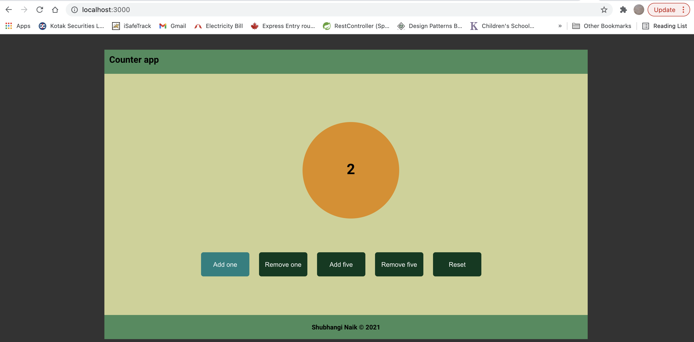

# Counter app

## Practice event handlers
### Create h1(counter) and assign classname dynamically that changes color of the counter-
1. circle: `#478C5C`;
2. odd: `rgb(224, 140, 13)`
3. even: `blue`
### Events(onClick)
* AddOne()
-- adds one to the counter(h1)
* RemoveOne()
-- removes one from counter
* AddFive()
-- adds five to the counter
* RemoveFive()
-- removes five from counter
* Reset()
-- resets counter to zero

